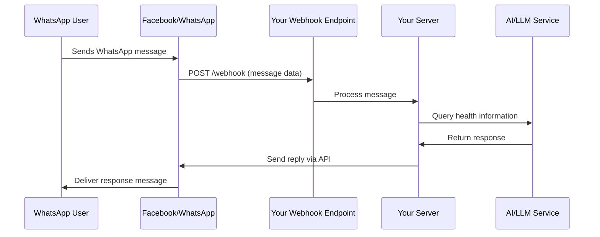

# WhatsApp Health Chatbot - Technical Documentation

## 🏗️ Project Architecture Overview

This WhatsApp Health Chatbot is a sophisticated multilingual health assistance system that integrates multiple technologies to provide seamless health information and support through WhatsApp Business API.

### Core Technologies Stack
- **Backend**: Node.js with Express.js framework
- **Frontend**: Vanilla HTML, CSS, JavaScript with responsive design
- **Database**: JSON-based file storage (users.json, healthData.json)
- **Authentication**: JWT (JSON Web Tokens) for secure user sessions
- **AI/LLM**: Google Generative AI with Hugging Face fallback
- **Messaging**: Facebook Business WhatsApp API
- **Deployment**: Multi-platform (Render, Vercel)
- **Development**: ngrok for local webhook testing

---

## 🛠️ Local Development Setup

### Prerequisites
```bash
Node.js (v16 or higher)
npm or yarn package manager
ngrok (for webhook testing)
Facebook Business Account
Google Cloud API account
```

### Step 1: Initial Setup
```bash
# Clone the repository
git clone https://github.com/ciphervaishnavi/SIH-WHATSAPP-AI-CHATBOT
cd sih-chatbot

# Install dependencies
npm install

# Create environment file
cp .env.example .env
```

### Step 2: Environment Configuration
Create `.env` file with the following variables:
```env
# Facebook Business WhatsApp API
FACEBOOK_ACCESS_TOKEN=your_facebook_access_token
FACEBOOK_PHONE_NUMBER_ID=your_whatsapp_business_phone_id
FACEBOOK_VERIFY_TOKEN=your_custom_verify_token
FACEBOOK_APP_SECRET=your_facebook_app_secret

# AI/LLM Services
GOOGLE_LLM_API_KEY=your_google_gemini_api_key
HUGGINGFACE_API_KEY=your_huggingface_api_key

# Authentication
JWT_SECRET=your_jwt_secret_key

# Server Configuration
PORT=3000
```

### Step 3: Start Local Server
```bash
# Start the Node.js server
node index.js

# Server will run on http://localhost:3000
```

---

## 🌐 ngrok Setup and Webhook Configuration

### What is ngrok?
ngrok is a tunneling service that creates a secure public URL that forwards to your local development server. This is essential for webhook testing because:

1. **Webhook Requirements**: Facebook requires HTTPS endpoints for webhooks
2. **Public Accessibility**: Your local server needs to be accessible from Facebook's servers
3. **Real-time Testing**: Allows testing with actual WhatsApp messages during development

### Setting up ngrok

#### Installation
```bash
# Download and install ngrok from https://ngrok.com/
# Or use package managers:

# macOS
brew install ngrok

# Windows (using Chocolatey)
choco install ngrok

# Or download directly and add to PATH
```

#### Authentication
```bash
# Sign up at ngrok.com and get your auth token
ngrok config add-authtoken YOUR_NGROK_AUTH_TOKEN
```

#### Creating the Tunnel
```bash
# In a separate terminal, while your Node.js server is running:
ngrok http 3000

# Output will show:
# Session Status: online
# Account: your_account
# Version: 3.x.x
# Region: United States (us)
# Web Interface: http://127.0.0.1:4040
# Forwarding: https://abc123.ngrok.io -> http://localhost:3000
```

### Important ngrok Concepts

1. **Dynamic URLs**: Free ngrok generates random URLs each time (e.g., `https://abc123.ngrok.io`)
2. **Persistent URLs**: Paid plans offer custom subdomains
3. **Session Management**: Keep ngrok running during development
4. **Port Forwarding**: Maps public HTTPS to local HTTP

---

## 🔗 Webhook Mechanics and Technical Details

### What are Webhooks?
Webhooks are HTTP callbacks that Facebook sends to your server when events occur (like receiving a WhatsApp message). Instead of your server constantly polling Facebook's API, Facebook "pushes" data to your server in real-time.

### Webhook Flow Architecture



### Webhook Verification Process

#### 1. Initial Verification (GET Request)
When you configure a webhook URL in Facebook, they send a verification request:

```javascript
// Facebook sends: GET /webhook?hub.mode=subscribe&hub.challenge=CHALLENGE&hub.verify_token=TOKEN
app.get('/webhook', (req, res) => {
    const mode = req.query['hub.mode'];
    const token = req.query['hub.verify_token'];
    const challenge = req.query['hub.challenge'];
    
    if (mode === 'subscribe' && token === process.env.FACEBOOK_VERIFY_TOKEN) {
        console.log('✅ Webhook verified');
        res.status(200).send(challenge); // Echo back the challenge
    } else {
        res.sendStatus(403); // Forbidden
    }
});
```

**Technical Details**:
- **hub.mode**: Always "subscribe" for verification
- **hub.verify_token**: Must match your configured token
- **hub.challenge**: Random string Facebook expects you to echo back
- **Response**: Must return the challenge string with 200 status

#### 2. Message Reception (POST Request)
When users send messages, Facebook sends webhook data:

```javascript
app.post('/webhook', async (req, res) => {
    const body = req.body;
    
    // Verify request came from Facebook
    if (req.headers['x-hub-signature-256']) {
        const signature = req.headers['x-hub-signature-256'];
        // Verify using FACEBOOK_APP_SECRET
    }
    
    // Process webhook data
    if (body.object === 'whatsapp_business_account') {
        body.entry.forEach(entry => {
            entry.changes.forEach(change => {
                if (change.value.messages) {
                    change.value.messages.forEach(message => {
                        processIncomingMessage(message, change.value);
                    });
                }
            });
        });
    }
    
    res.status(200).send('EVENT_RECEIVED');
});
```

### Webhook Payload Structure

#### Incoming Message Structure
```json
{
  "object": "whatsapp_business_account",
  "entry": [
    {
      "id": "WHATSAPP_BUSINESS_ACCOUNT_ID",
      "changes": [
        {
          "value": {
            "messaging_product": "whatsapp",
            "metadata": {
              "display_phone_number": "PHONE_NUMBER",
              "phone_number_id": "PHONE_NUMBER_ID"
            },
            "contacts": [
              {
                "profile": {
                  "name": "USER_NAME"
                },
                "wa_id": "USER_WHATSAPP_ID"
              }
            ],
            "messages": [
              {
                "from": "USER_PHONE_NUMBER",
                "id": "MESSAGE_ID",
                "timestamp": "TIMESTAMP",
                "text": {
                  "body": "USER_MESSAGE_TEXT"
                },
                "type": "text"
              }
            ]
          },
          "field": "messages"
        }
      ]
    }
  ]
}
```

### Local Webhook Testing Process

1. **Start Local Server**:
   ```bash
   node index.js
   # Server runs on http://localhost:3000
   ```

2. **Start ngrok Tunnel**:
   ```bash
   ngrok http 3000
   # Get public URL: https://abc123.ngrok.io
   ```

3. **Configure Facebook Webhook**:
   - Go to Facebook Developer Console
   - Navigate to WhatsApp > Configuration
   - Set Webhook URL: `https://abc123.ngrok.io/webhook`
   - Set Verify Token: (your custom token from .env)
   - Subscribe to message events

4. **Test Webhook**:
   ```bash
   # Manual test
   curl -X GET "https://abc123.ngrok.io/webhook?hub.mode=subscribe&hub.challenge=test&hub.verify_token=your_token"
   ```

### Security Considerations

#### Signature Verification
Facebook signs each webhook request for security:

```javascript
function verifyWebhookSignature(payload, signature) {
    const expectedSignature = crypto
        .createHmac('sha256', process.env.FACEBOOK_APP_SECRET)
        .update(payload, 'utf8')
        .digest('hex');
    
    const signatureHash = signature.replace('sha256=', '');
    return crypto.timingSafeEqual(
        Buffer.from(expectedSignature, 'hex'),
        Buffer.from(signatureHash, 'hex')
    );
}
```

---

## 🤖 AI/LLM Integration Architecture

### Multi-Layer AI System

#### 1. Primary AI: Google Gemini
```javascript
// Google Generative AI initialization
const genAI = new GoogleGenerativeAI(process.env.GOOGLE_LLM_API_KEY);
const model = genAI.getGenerativeModel({ model: "gemini-1.5-flash" });

async function queryGoogleLLM(message, language) {
    const prompt = `Respond in ${language}. Health query: ${message}`;
    const result = await model.generateContent(prompt);
    return result.response.text();
}
```

#### 2. Fallback AI: Hugging Face
```javascript
// Hugging Face Inference API
const hf = new HfInference(process.env.HUGGINGFACE_API_KEY);

async function queryHuggingFace(message) {
    const response = await hf.textGeneration({
        model: 'microsoft/DialoGPT-large',
        inputs: message,
        parameters: { max_new_tokens: 150 }
    });
    return response.generated_text;
}
```

#### 3. Local Health Database
```javascript
// JSON-based health responses
const healthResponses = {
    "flu": {
        "en": "Flu symptoms include fever, cough, body aches...",
        "hi": "फ्लू के लक्षणों में बुखार, खांसी, शरीर में दर्द...",
        "or": "ଫ୍ଲୁର ଲକ୍ଷଣଗୁଡ଼ିକରେ ଜ୍ୱର, କାଶ, ଶରୀର ଯନ୍ତ୍ରଣା..."
    }
};
```

### AI Decision Flow
```javascript
async function processHealthQuery(message, language, from) {
    try {
        // 1. Check local health database first
        const localResponse = findLocalHealthResponse(message, language);
        if (localResponse) return localResponse;
        
        // 2. Try Google Gemini
        const geminiResponse = await queryGoogleLLM(message, language);
        if (geminiResponse) return geminiResponse;
        
        // 3. Fallback to Hugging Face
        const hfResponse = await queryHuggingFace(message);
        return hfResponse;
        
    } catch (error) {
        return getDefaultErrorMessage(language);
    }
}
```

---

## 🚀 Deployment Processes

### 1. Render Deployment

#### Configuration (render.yaml)
```yaml
services:
  - type: web
    name: whatsapp-health-bot
    runtime: node
    buildCommand: npm install
    startCommand: node index.js
    envVars:
      - key: NODE_ENV
        value: production
      - key: PORT
        value: 10000
```

#### Process:
1. **Connect Repository**: Link GitHub repo to Render
2. **Auto-deployment**: Render automatically deploys on git push
3. **Environment Variables**: Set in Render dashboard
4. **Live URL**: Get permanent URL (e.g., `https://your-app.onrender.com`)
5. **Webhook Update**: Update Facebook webhook URL to production URL

### 2. Netlify Functions Deployment

#### Serverless Architecture
Netlify uses serverless functions instead of a persistent server:

```javascript
// netlify/functions/webhook.js
exports.handler = async (event, context) => {
    // Handle webhook logic
    return {
        statusCode: 200,
        headers: { 'Content-Type': 'application/json' },
        body: JSON.stringify({ status: 'success' })
    };
};
```

#### Configuration (netlify.toml)
```toml
[build]
  functions = "netlify/functions"
  publish = "public"

[[redirects]]
  from = "/api/*"
  to = "/.netlify/functions/:splat"
  status = 200
```

#### Process:
1. **Code Structure**: Convert Express routes to Netlify functions
2. **Static Files**: Frontend served from /public directory
3. **API Routes**: Mapped to /.netlify/functions/
4. **Deployment**: Automatic on git push to main branch

### 3. Vercel Deployment

#### Configuration (vercel.json)
```json
{
  "version": 2,
  "builds": [
    {
      "src": "index.js",
      "use": "@vercel/node"
    }
  ],
  "routes": [
    {
      "src": "/(.*)",
      "dest": "/index.js"
    }
  ]
}
```

---

## 📱 Facebook Business WhatsApp API Integration

### Step-by-Step Setup Process

#### 1. Facebook Developer Account Setup
1. **Create Facebook Developer Account**:
   - Go to https://developers.facebook.com/
   - Create account and verify identity
   - Create new app for "Business"

2. **Add WhatsApp Product**:
   - In app dashboard, click "Add Product"
   - Select "WhatsApp" and click "Set Up"
   - This creates your WhatsApp Business API access

#### 2. Phone Number Configuration

##### Get WhatsApp Business Phone Number:
```bash
# API endpoint to get available phone numbers
GET https://graph.facebook.com/v17.0/{app-id}/phone_numbers
Authorization: Bearer {access-token}
```

##### Configure Phone Number:
1. **Navigate to WhatsApp > API Setup**
2. **Select Phone Number**: Choose from available numbers or request new
3. **Verify Phone Number**: Complete SMS/call verification
4. **Set Display Name**: Business name users will see

#### 3. Access Token Generation

##### Temporary Token (Development):
- Available in Facebook Developer Console
- Valid for 24 hours
- Found in WhatsApp > API Setup > Access Token

##### Permanent Token (Production):
```javascript
// Exchange temporary token for permanent
const permanentToken = await exchangeForLongLivedToken(temporaryToken);

async function exchangeForLongLivedToken(shortToken) {
    const response = await fetch(
        `https://graph.facebook.com/oauth/access_token?` +
        `grant_type=fb_exchange_token&` +
        `client_id=${APP_ID}&` +
        `client_secret=${APP_SECRET}&` +
        `fb_exchange_token=${shortToken}`
    );
    return response.json();
}
```

#### 4. Webhook Configuration

##### In Facebook Developer Console:
1. **Go to WhatsApp > Configuration**
2. **Set Webhook URL**: Your production URL + `/webhook`
   - Example: `https://your-app.onrender.com/webhook`
3. **Set Verify Token**: Custom string (store in .env)
4. **Subscribe to Events**:
   - `messages`: Incoming messages
   - `message_deliveries`: Delivery confirmations
   - `message_reads`: Read receipts

##### Webhook Fields:
```javascript
// Subscribe to these webhook fields
const webhookFields = [
    'messages',           // Incoming messages
    'message_deliveries', // Delivery status
    'message_reads',      // Read receipts
    'messaging_postbacks' // Button responses
];
```

#### 5. Message Sending Implementation

##### Send Text Message:
```javascript
async function sendWhatsAppMessage(to, message) {
    const url = `https://graph.facebook.com/v17.0/${PHONE_NUMBER_ID}/messages`;
    
    const payload = {
        messaging_product: 'whatsapp',
        to: to,
        type: 'text',
        text: { body: message }
    };
    
    const response = await fetch(url, {
        method: 'POST',
        headers: {
            'Authorization': `Bearer ${ACCESS_TOKEN}`,
            'Content-Type': 'application/json'
        },
        body: JSON.stringify(payload)
    });
    
    return response.json();
}
```

##### Send Template Message:
```javascript
async function sendTemplateMessage(to, templateName, language) {
    const payload = {
        messaging_product: 'whatsapp',
        to: to,
        type: 'template',
        template: {
            name: templateName,
            language: { code: language }
        }
    };
    
    // Send via Facebook Graph API
}
```

### API Rate Limits and Best Practices

#### Rate Limits:
- **Messaging**: 250 messages per second per phone number
- **API Calls**: 200 calls per hour per access token
- **Webhook**: 1000 webhooks per second

#### Best Practices:
1. **Message Quality**: Maintain high message success rate
2. **User Consent**: Only message users who opted in
3. **Response Time**: Respond to messages within 24 hours
4. **Error Handling**: Implement retry logic for failed messages

---

## 🔐 Authentication and Security

### JWT Token System

#### Token Generation:
```javascript
const jwt = require('jsonwebtoken');

function generateToken(user) {
    return jwt.sign(
        { 
            id: user.id, 
            email: user.email 
        },
        process.env.JWT_SECRET,
        { 
            expiresIn: '24h' // or '30d' for remember me
        }
    );
}
```

#### Token Verification Middleware:
```javascript
function authenticateToken(req, res, next) {
    const authHeader = req.headers['authorization'];
    const token = authHeader && authHeader.split(' ')[1];
    
    if (!token) {
        return res.status(401).json({ message: 'Access token required' });
    }
    
    jwt.verify(token, process.env.JWT_SECRET, (err, user) => {
        if (err) return res.status(403).json({ message: 'Invalid token' });
        req.user = user;
        next();
    });
}
```

### Security Measures

#### 1. Environment Variables:
```bash
# Never commit .env to git
echo ".env" >> .gitignore

# Use strong secrets
JWT_SECRET=ultra-secure-random-string-min-32-chars
FACEBOOK_APP_SECRET=your-facebook-app-secret
```

#### 2. Request Validation:
```javascript
// Validate Facebook webhook signatures
function validateSignature(payload, signature) {
    const expectedSignature = crypto
        .createHmac('sha256', process.env.FACEBOOK_APP_SECRET)
        .update(payload, 'utf8')
        .digest('hex');
    
    return signature === `sha256=${expectedSignature}`;
}
```

#### 3. Input Sanitization:
```javascript
const validator = require('validator');

function sanitizeInput(input) {
    return validator.escape(validator.trim(input));
}
```

---

## 📊 Data Storage and Management

### User Data Structure (users.json)
```json
{
  "users": [
    {
      "id": "unique-timestamp-id",
      "name": "User Name",
      "email": "user@example.com",
      "phone": "+1234567890",
      "language": "en",
      "password": "$2b$10$hashed.password.here",
      "registeredAt": "2025-09-19T10:30:00.000Z",
      "lastActive": "2025-09-19T10:35:00.000Z",
      "totalMessages": 15,
      "settings": {
        "dailyTips": true,
        "emailNotifications": false
      }
    }
  ],
  "registeredNumbers": ["+1234567890", "+0987654321"],
  "userStats": {
    "user-id": {
      "whatsappRegistered": true,
      "registeredAt": "2025-09-19T10:30:00.000Z",
      "totalInteractions": 25
    }
  }
}
```

### Health Data Structure (healthData.json)
```json
{
  "topics": {
    "flu": {
      "keywords": ["flu", "influenza", "fever", "cold"],
      "responses": {
        "en": "Detailed flu information in English...",
        "hi": "अंग्रेजी में विस्तृत फ्लू जानकारी...",
        "or": "ଇଂରାଜୀରେ ବିସ୍ତୃତ ଫ୍ଲୁ ସୂଚନା..."
      }
    }
  },
  "alerts": [
    {
      "id": "alert-1",
      "type": "outbreak",
      "severity": "high",
      "message": {
        "en": "Health alert message...",
        "hi": "स्वास्थ्य चेतावनी संदेश...",
        "or": "ସ୍ୱାସ୍ଥ୍ୟ ଚେତାବନୀ ବାର୍ତ୍ତା..."
      }
    }
  ]
}
```

### File Operations:
```javascript
const fs = require('fs');
const path = require('path');

function loadUsers() {
    try {
        const usersPath = path.join(__dirname, 'users.json');
        const rawData = fs.readFileSync(usersPath);
        return JSON.parse(rawData);
    } catch (error) {
        return { users: [], registeredNumbers: [], userStats: {} };
    }
}

function saveUsers(userData) {
    try {
        const usersPath = path.join(__dirname, 'users.json');
        fs.writeFileSync(usersPath, JSON.stringify(userData, null, 2));
        return true;
    } catch (error) {
        console.error('Error saving users:', error);
        return false;
    }
}
```

---

## 🌍 Multilingual Support System

### Language Detection and Response

#### Automatic Language Detection:
```javascript
function detectLanguage(message) {
    // Hindi indicators
    if (/[\u0900-\u097F]/.test(message)) return 'hi';
    
    // Oriya indicators  
    if (/[\u0B00-\u0B7F]/.test(message)) return 'or';
    
    // Default to English
    return 'en';
}
```

#### Language-Specific Responses:
```javascript
const greetings = {
    en: "Hello! I'm your health assistant. How can I help you today?",
    hi: "नमस्ते! मैं आपका स्वास्थ्य सहायक हूं। आज मैं आपकी कैसे मदद कर सकता हूं?",
    or: "ନମସ୍କାର! ମୁଁ ଆପଣଙ୍କର ସ୍ୱାସ୍ଥ୍ୟ ସହାୟକ। ଆଜି ମୁଁ ଆପଣଙ୍କୁ କିପରି ସାହାଯ୍ୟ କରିପାରିବି?"
};

function getLocalizedResponse(key, language) {
    return responses[key][language] || responses[key]['en'];
}
```

---

## 🔍 Testing and Debugging

### Local Testing Setup

#### 1. Server Testing:
```bash
# Test server startup
node index.js

# Test health endpoint
curl http://localhost:3000/health

# Test webhook verification
curl -X GET "http://localhost:3000/webhook?hub.mode=subscribe&hub.challenge=test&hub.verify_token=your_token"
```

#### 2. ngrok Testing:
```bash
# Start ngrok
ngrok http 3000

# Test public endpoint
curl https://your-ngrok-url.ngrok.io/health

# Test webhook with Facebook
# Use ngrok URL in Facebook Developer Console
```

#### 3. API Testing:
```bash
# Test user registration
curl -X POST http://localhost:3000/api/register \
  -H "Content-Type: application/json" \
  -d '{
    "name": "Test User",
    "email": "test@example.com", 
    "phone": "+1234567890",
    "language": "en",
    "password": "testpass123",
    "terms": true
  }'

# Test WhatsApp message sending
curl -X POST "https://graph.facebook.com/v17.0/PHONE_NUMBER_ID/messages" \
  -H "Authorization: Bearer ACCESS_TOKEN" \
  -H "Content-Type: application/json" \
  -d '{
    "messaging_product": "whatsapp",
    "to": "RECIPIENT_PHONE",
    "type": "text",
    "text": { "body": "Test message from bot" }
  }'
```

### Debug Tools and Logging

#### Enhanced Logging:
```javascript
// Structured logging with colors
const colors = {
    reset: '\x1b[0m',
    red: '\x1b[31m',
    green: '\x1b[32m',
    yellow: '\x1b[33m',
    blue: '\x1b[34m'
};

function log(level, message, data = null) {
    const timestamp = new Date().toISOString();
    const color = colors[level] || colors.reset;
    
    console.log(`${color}[${timestamp}] ${level.toUpperCase()}: ${message}${colors.reset}`);
    if (data) console.log(JSON.stringify(data, null, 2));
}

// Usage
log('green', '✅ Message sent successfully', { to: phoneNumber });
log('red', '❌ Error sending message', { error: error.message });
```

#### Webhook Debugging:
```javascript
app.post('/webhook', (req, res) => {
    console.log('🔍 Webhook received:');
    console.log('Headers:', req.headers);
    console.log('Body:', JSON.stringify(req.body, null, 2));
    
    // Process webhook...
    
    res.status(200).send('EVENT_RECEIVED');
});
```

---

## 🚨 Troubleshooting Common Issues

### 1. Webhook Verification Failed
**Problem**: Facebook can't verify your webhook
**Solutions**:
- Ensure ngrok is running and URL is accessible
- Check FACEBOOK_VERIFY_TOKEN matches exactly
- Verify webhook endpoint returns 200 status
- Test manually: `curl -X GET "your-url/webhook?hub.mode=subscribe&hub.challenge=test&hub.verify_token=your_token"`

### 2. Messages Not Received
**Problem**: Bot doesn't respond to WhatsApp messages
**Solutions**:
- Check webhook subscription in Facebook Console
- Verify phone number is properly configured
- Test webhook with test messages
- Check server logs for errors
- Ensure webhook URL is using production/ngrok URL

### 3. "Invalid Token" Errors
**Problem**: Facebook API returns authentication errors
**Solutions**:
- Regenerate access token in Facebook Console
- Check token expiration (use permanent tokens for production)
- Verify FACEBOOK_ACCESS_TOKEN in .env file
- Test token: `curl -X GET "https://graph.facebook.com/v17.0/me?access_token=YOUR_TOKEN"`

### 4. CORS Issues (Frontend)
**Problem**: Browser blocks API requests
**Solutions**:
- Ensure CORS headers are set in backend
- Check API_BASE URL configuration
- Verify frontend and backend URLs match
- For Netlify, check function configurations

### 5. Rate Limiting
**Problem**: Too many API requests
**Solutions**:
- Implement request queuing
- Add delays between API calls  
- Monitor API quotas in Facebook Console
- Use batch API calls when possible

---

## 📈 Performance Optimization

### 1. Response Time Optimization
```javascript
// Cache frequent responses
const responseCache = new Map();

function getCachedResponse(query, language) {
    const key = `${query}_${language}`;
    return responseCache.get(key);
}

function setCachedResponse(query, language, response) {
    const key = `${query}_${language}`;
    responseCache.set(key, response);
}
```

### 2. Database Optimization
```javascript
// Index users by email for faster lookup
const userEmailIndex = new Map();

function indexUsers(users) {
    users.forEach(user => {
        userEmailIndex.set(user.email, user);
    });
}

function findUserByEmail(email) {
    return userEmailIndex.get(email);
}
```

### 3. Memory Management
```javascript
// Periodic cleanup of temporary data
setInterval(() => {
    // Clear old cache entries
    responseCache.clear();
    
    // Clean up expired tokens
    cleanupExpiredTokens();
    
    console.log('🧹 Memory cleanup completed');
}, 1000 * 60 * 60); // Every hour
```

---

## 🔒 Security Best Practices

### 1. Environment Security
- Never commit `.env` files to git
- Use strong, random secrets (minimum 32 characters)
- Rotate tokens regularly
- Use different tokens for development/production

### 2. API Security
- Validate all incoming webhook signatures
- Implement rate limiting
- Sanitize user inputs
- Use HTTPS everywhere

### 3. Data Protection
- Hash passwords with bcrypt (minimum 10 rounds)
- Encrypt sensitive data at rest
- Implement proper session management
- Regular security audits

---

## 📋 Production Checklist

### Pre-Deployment
- [ ] All environment variables configured
- [ ] Database backups created
- [ ] Security audit completed
- [ ] Performance testing done
- [ ] Error handling implemented
- [ ] Logging configured

### Deployment
- [ ] Production environment setup
- [ ] Domain/URL configured
- [ ] SSL certificates installed
- [ ] Facebook webhook URL updated
- [ ] Phone number verification completed
- [ ] Access tokens updated to permanent

### Post-Deployment
- [ ] Health checks passing
- [ ] Webhook receiving messages
- [ ] AI responses working
- [ ] User registration functional
- [ ] Monitoring setup
- [ ] Backup procedures in place

---

## 🆘 Support and Maintenance

### Monitoring
- Set up uptime monitoring (UptimeRobot, Pingdom)
- Monitor API quotas and rate limits
- Track error rates and response times
- Set up alerts for critical failures

### Regular Maintenance
- Update dependencies monthly
- Rotate access tokens quarterly
- Review and clean up old data
- Performance optimization reviews
- Security patches and updates

### Documentation Updates
- Keep API documentation current
- Update deployment guides
- Maintain troubleshooting guides
- Document configuration changes

---

## 📚 Additional Resources

### Official Documentation
- [Facebook WhatsApp Business API](https://developers.facebook.com/docs/whatsapp)
- [Google Generative AI](https://ai.google.dev/docs)
- [Hugging Face Inference API](https://huggingface.co/docs/api-inference)
- [ngrok Documentation](https://ngrok.com/docs)

### Deployment Platforms
- [Render Documentation](https://render.com/docs)
- [Netlify Functions](https://docs.netlify.com/functions/overview/)
- [Vercel Documentation](https://vercel.com/docs)

### Development Tools
- [Postman for API Testing](https://www.postman.com/)
- [VS Code Extensions](https://marketplace.visualstudio.com/)
- [Git Best Practices](https://git-scm.com/docs)

---

This comprehensive documentation covers the complete technical implementation of the WhatsApp Health Chatbot, from local development setup through production deployment. Each section provides detailed explanations of the underlying technologies, step-by-step processes, and troubleshooting guides to ensure successful implementation and maintenance.